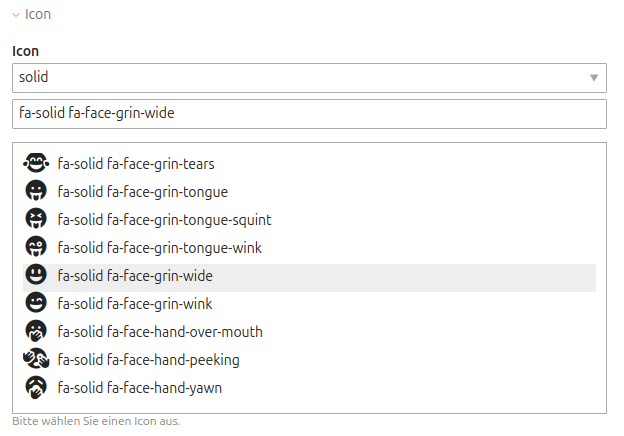

# IconToolkit


## Beschreibung

Bei dieser Software handelt es sich um eine Erweiterung für das Open Source CMS Contao. Sie bietet Werkzeuge zur Verwendung
von [Font Awesome](https://fontawesome.com/). Unter anderem stellt sie ein IconPicker für das Backend und ein Modul zur
Einbindung der Assets für das Frontend zur Verfügung.

Font Awesome 7.1.0 wird mit ausgeliefert.


## Autor

__NetGroup GmbH:__ Patrick Froch <info@netgroup.de>


## Support

NetGroup Gesellschaft für Informationstechnologien in Deutschland mbH<br>
Kaiserstraße 67<br>
44135 Dortmund

Kontakt:<br>
Telefon: +49 231 557509-0<br>
Telefax: +49 231 557509-99<br>
E-Mail: info@netgroup.de

Internet: https://www.netgroup.de/icontoolkit.html


## Voraussetzungen

- php: ^8.2
- Contao: ^4.13 | ^5.0


## Installation

Die Erweiterung kann bequem über den **Contao Manager** installiert werden. Einfach nach `netgroup/userguide` suchen.

Alternativ via Composer:

```bash
composer require netgroup/icontoolkit
```


## Verwendung

### Backend Widget

Das Backend Widget kann für die Auswahl eines Icons verwendet werden.

```php
$GLOBALS['TL_DCA'][$table]['palettes']['text'] .= ';{icon_legend},icotest;';

$GLOBALS['TL_DCA']['tl_content']['fields']['icotest'] = [
    'label'                 => &$GLOBALS['TL_LANG'][$table]['icotest'],
    'inputType'             => IconPickerWidget::TYPE,
    'eval'                  => ['maxlength'=>255, 'tl_class' => 'w50'],
    'sql'                   => "varchar(255) NOT NULL default ''"
];
```

Die Ausgabe sieht dann wie folgt aus:




### Frontend Module

Für das Einbinden des CSS gibt es das Frontend Modul "IconHelper". Es bindet nur das CSS ein und erzeugt sonst keine Ausgabe.

Im Frontend können die Icons ganz normal verwendet werden:

```html
<i class="fa-brands fa-contao"></i>
```


### AssetHelper

Mit dem `AssetHelper` kann ganz einfach das CSS für die Icons eingebunden werden. Er kann z. B. in eigenen Inhaltselementen, oder
Module verwendet werden.

```php
use NetGroup\IconToolkit\Classes\Services\Helper\AssetHelper;

MyClass {
    public function __construct(private readonly AssetHelper $assetHelper)
    {
    }

    public function myFunction(): void
    {
        $this->assetHelper->incldueCss();
    }
}
```


## Font Awesome

Die aktuelle Version von Font Awesome kann auf folgender Seite bezogen werden: https://fontawesome.com/download

Aus dem Archiv werden die Ordner `css` und `webfonts`, sowie die Daten `metadata/icons.json` benötigt.


## Alternative Icon Packs

In den Einstellungen an die CSS-Datei eines alternativen Iconpacks ausgewählt werden. Zusätzlich muss die JSON-Datei
mit der Definition der Icons ausgewählt werden. _(Diese muss dem Aufbau der Datei `metadata/icons.json` von Font Awesome entsprechen)_


## Mitwirken

Beiträge sind herzlich willkommen!
Bitte erstellen Sie bei größeren Änderungen zunächst ein Issue, um die geplanten Anpassungen zu besprechen.

Pull Requests sollten mit entsprechenden Tests ergänzt werden.


## Tests

Tests können mit folgendem Skript im Wurzelverzeichnis der Erweiterung ausgeführt werden:

```bash
./build/runtests.sh
```

_(Dies setzt voraus, dass die Erweiterung unter `CONTAO_ROOT/src/NetGroup/IconToolkit` installiert ist. Ist dies nicht
der Fall, müssen die Testtools einzeln aufgerufen werden. Die Kommandos stehen in der oben genannten Datei.)_


## Getestete Versionen

Die Erweiterung wurde erfolgreich mit folgenden Kombinationen aus PHP und Contao getestet:


| Contao                                                                            |  |  |  |
|-----------------------------------------------------------------------------------|---------------------------------------------------------------------------|---------------------------------------------------------------------------|---------------------------------------------------------------------------|
|  | &#10003;                                                                  | &#10003;                                                                  | &#10003;                                                                  |
|    | &#10003;                                                                  | &#10003;                                                                  | &#10003;                                                                  |
|    | &#10003;                                                                  | &#10003;                                                                  | &#10003;                                                                  |
|    | &#10003;                                                                  | &#10003;                                                                  | &#10003;                                                                  |
|    | &#10003;                                                                  | &#10003;                                                                  | &#10003;                                                                  |
|    | &#10003;                                                                  | &#10003;                                                                  | &#10003;                                                                  |
|    | &#10003;                                                                  | &#10003;                                                                  | &#10003;                                                                  |


## Lizenz

Dieses Projekt steht unter der [Apache 2.0 Lizenz](https://choosealicense.com/licenses/apache-2.0/).